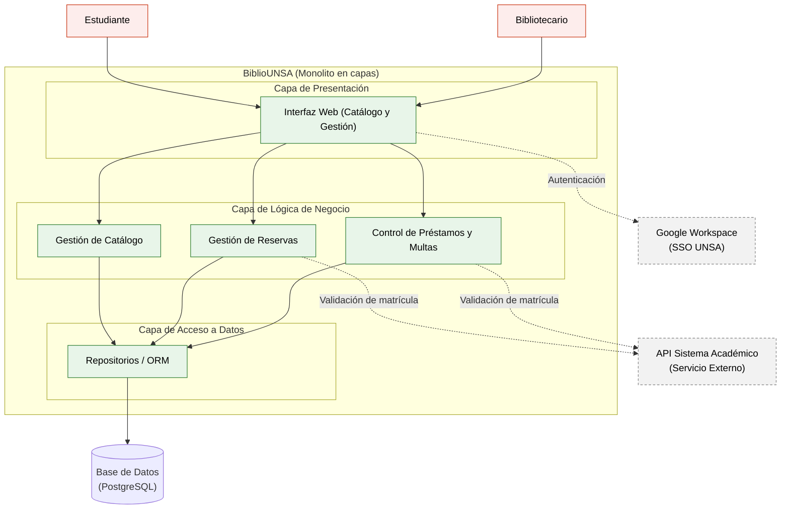

# BiblioUNSA - Laboratorio 04: Fundamentos de arquitectura de software
Construcción de Software - EPIS-UNSA

## Integrantes
- 2026-B Grupo 01
- William Choquehuanca Berna | Developer Full-Stack, Redactor de ADR, Diagramador y Verificador de IA

## Caso
El sistema BiblioUNSA permite gestionar el préstamo y la reserva de libros en las bibliotecas de la universidad. Los estudiantes pueden consultar el catálogo en línea y reservar textos, mientras que los bibliotecarios gestionan los préstamos mediante el escaneo de un carné QR y controlan las multas. El atributo de calidad crítico es la **Interoperabilidad**, ya que el sistema debe validar si la matrícula del estudiante está vigente consultando el sistema académico mediante una API externa, manteniendo la seguridad e independencia de los datos.

## Arquitectura elegida

## Decisiones arquitectónicas
- [ADR-001: Adoptar un monolito en capas para el MVP](docs/architecture/adr/001-estilo-arquitectonico.md)
- [ADR-002: Uso de OAuth 2.0 (Google Workspace) para autenticación](docs/architecture/adr/002-autenticacion-sso.md)
- [ADR-003: Uso de PostgreSQL como base de datos relacional](docs/architecture/adr/003-base-de-datos.md)

## Reflexión sobre el uso de la IA
El uso de asistentes de IA fue fundamental para agilizar la generación de diagramas como código y estructurar rápidamente la documentación de las decisiones. Sin embargo, la herramienta demostró un sesgo evidente hacia arquitecturas complejas, recomendando inicialmente un enfoque de microservicios. Como único desarrollador con un plazo de entrega de un mes y presupuesto nulo, aplicar esa recomendación habría llevado al fracaso operativo del proyecto. Esto subraya que la IA es excelente proponiendo y redactando, pero el juicio arquitectónico y la validación estricta contra las restricciones reales siguen siendo responsabilidad exclusiva del ingeniero.